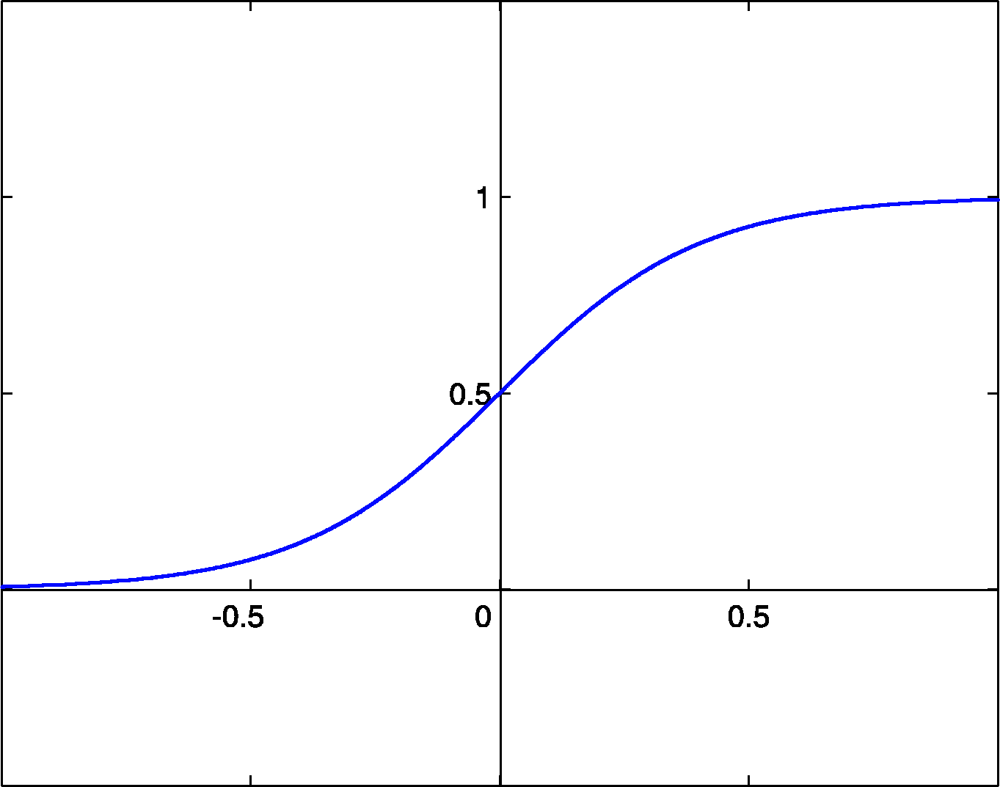
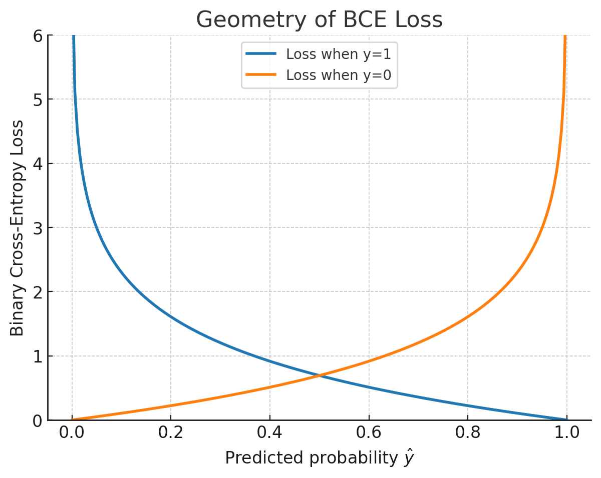

# 1. Models lineals

En aquest capítol repassarem els models lineals, un dels enfocaments més senzills i alhora fonamentals de l'aprenentatge automàtic. Malgrat la seva simplicitat, aquests models permeten introduir conceptes clau com la definició d'una funció de pèrdua o el procés d'optimització, que constitueixen la base sobre la qual s'edifiquen els models d'aprenentatge profund.

 La sortida d'un model lineal és basa en una combinació lineals de les dades entrada, $\textbf{x}$, i els paràmetres del model, $\textbf{w}$. Sigui $\hat{y}$ el valor que el nostre model prediu que hauria de tenir $y$, definim la sortida com:

$$\widehat{y} = f \left(b + \overset{n}{\sum_{j = 1}}w_{j} \cdot x_{j} \right),$$

on $\widehat{y}$ és el valor de predicció, $f$ és una funció donada normalment anomenada funció d'activació, $\mathbf{w} = (w_{1},\ldots,w_{j},\ldots,w_{n})$ és el vector de paràmetres del model i $b$ és un paràmetre addicional denominat biaix. Sense aquest terme, la recta (o hiperplà, en dimensions més altes) que representa el model estaria obligada a passar sempre per l'origen de coordenades, es a dir, quan totes les entrades $x$ són zero, la predicció $\hat{y}$​ també seria necessàriament zero. Aquesta és una restricció innecessària en la majoria de problemes reals.

Generalment, es reordena el paràmetre biaix perquè pugui ser ajustat de la mateixa manera que la resta de paràmetres i es defineix com el primer element del vector de paràmetres ${0} = b$, i es ponderarà amb un valor d'entrada constant que és sempre $1$ (a nivell de codi, augmentem el vector de característiques en una dimensió). Així, el model quedaria:

$$\widehat{y} = f\left(\overset{n}{\sum_{j = 0}}w_{j} \cdot x_{j}, \; \text{on} \; x_{0} = 1\right) .$$

## Regressió

L'objectiu dels problemes de regressió és construir un sistema capaç d'agafar un vector $x \in \mathbb{R}^n$ com a entrada i predir el valor d'un escalar $y \in \mathbb{R}$ com a sortida. En el cas dels problemes de regressió la funció d'activació sol ser $z = f(z)$ on $z$ és la combinació lineal de les entrades amb els paràmetres del model.

Com a exemple pràctic, considerem un conjunt de dades de vendes d'habitatges, on cada mostra recull les característiques d'un immoble i el seu preu de venda. Podríem construir una taula, on cada fila correspon a una propietat immobiliària diferent, i cada columna correspon a alguna característica, com els metres quadrats, el nombre d'habitacions o de banys, les plantes, o la seva antiguitat. Aquesta taula seria el nostre conjunt de dades, i cada exemple seria una fila de la taula, que correspondria a una propietat immobiliària específica amb les seves característiques. El preu de l'immoble és l'etiqueta del valor desitjat i, per tant, partint de la suposició que aquest és una combinació lineal ponderada de les característiques de l'immoble podríem emprar el model de lineal abans descrit.

En aquest cas d'exemple és poc realista pensar que un pis de 0 $m^2$ costa 0 €. El terme de biaix permet que la recta de regressió talli l'eix vertical en un punt diferent de zero, oferint així molta més flexibilitat al model per ajustar-se a les dades reals.

Un cop tenim el conjunt de dades i el model, necessitem un aplicar l'algorisme del descens de gradient que és capaç de trobar els millors paràmetres possibles per minimitzar la funció de pèrdua que, en els problemes de regressió, sol ser la diferència al quadrat entre la predicció i el valor desitjat:

$$J(\mathbf{w}) = \frac{1}{2}(\widehat{y} - y)^{2}.$$

El factor $\dfrac{1}{2}$ s'inclou per conveniència, ja que cancel·la amb l'exponent en derivar, simplificant els càlculs.

Els detalls de l'algorisme del descens del gradient i alguns exemples d'aplicació pràctica es troben disponibles en el següent [enllaç](2_models_lineals_descens_gradient.md).

### Derivació del descens del gradient per la regressió

Volem calcular $\dfrac{\partial J}{\partial w_j}$ per a cada pes $w_j$. La cadena de dependències és:

$$w_j \;\longrightarrow\; \hat{y} \;\longrightarrow\; J$$

Per la regla de la cadena:

$$\frac{\partial J}{\partial w_j} = \frac{\partial J}{\partial \hat{y}} \cdot \frac{\partial \hat{y}}{\partial w_j}.$$

#### 1. Derivada de $J$ respecte a $\hat{y}$: 

$$\frac{\partial J}{\partial \hat{y}^{(i)}} = \frac{\partial}{\partial \hat{y}^{(i)}} \left[\frac{1}{2}\left(\hat{y}^{(i)} - y^{(i)}\right)^2\right] = \left(\hat{y}^{(i)} - y^{(i)}\right).$$

#### 2. Derivada de $\hat{y}$ respecte a $w_j$

Com que $\hat{y} = \displaystyle\sum_{j=0}^{n} w_j x_j$, tractem tots els pesos $w_k$ amb $k \neq j$ com a constants:

$$\frac{\partial \hat{y}^{(i)}}{\partial w_j} = x_j^{(i)}.$$

Combinem els dos passos aplicant la regla de la cadena i sumant sobre tots els exemples:

$$\frac{\partial J}{\partial w_j} =  \left(\hat{y}^{(i)} - y^{(i)}\right) \cdot x_j^{(i)}.$$

Aplicant la regla del descens del gradient $w_j \leftarrow w_j - \alpha \dfrac{\partial J}{\partial w_j}$:

$$w_j = w_j - {\alpha} \left(\hat{y}^{(i)} - y^{(i)}\right) \cdot x_j^{(i)}.$$

on $\alpha > 0$ és la taxa d'aprenentatge (*learning rate*).

La regla d'actualització té una interpretació clara. Quan el model sobreestima ($\hat{y}^{(i)} > y^{(i)}$), l'error $(\hat{y}^{(i)} - y^{(i)}) > 0$ i el pes $w_j$ disminueix. Quan el model subestima ($\hat{y}^{(i)} < y^{(i)}$), l'error $(\hat{y}^{(i)} - y^{(i)}) < 0$ i el pes $w_j$ augmenta. A més, com més gran és el valor de la característica $x_j^{(i)}$, més gran és la correcció aplicada al pes $w_j$ corresponent.

## Variants del descens de gradient

Val la pena aturar-nos en com s'aplica realment el descens de gradient a la pràctica, ja que hi ha diverses maneres d'utilitzar les dades disponibles a cada pas d'actualització, i aquesta decisió té un impacte important tant en la velocitat com en l'estabilitat de l'entrenament.

En el **batch gradient descent**, el gradient es calcula utilitzant tot el conjunt de dades d'entrenament a cada iteració, la qual cosa produeix una trajectòria de descens molt estable i precisa, però resulta extremadament costosa quan el conjunt de dades és gran, ja que cal processar-lo íntegrament abans de fer una sola actualització dels paràmetres.

A l'altre extrem trobem l'**stochastic gradient descent** (_SGD_), on el gradient s'estima a partir d'un únic exemple triat a l'atzar a cada iteració. Això permet actualitzacions molt més ràpides i fa possible aprendre de manera incremental, però introdueix molt soroll en l'estimació del gradient, de manera que la trajectòria d'aprenentatge esdevé força irregular i sol necessitar més iteracions per convergir de manera fiable.

El **mini-batch gradient descent** neix precisament com un compromís entre aquests dos extrems: en lloc d'utilitzar tot el conjunt de dades o un únic exemple, es calcula el gradient a partir d'un petit subconjunt de dades a cada pas anomenat _batch_. D'aquesta manera s'aconsegueix reduir considerablement el soroll respecte al _SGD_ pur, sense arribar al cost computacional del conjunt complet, i alhora s'aprofita molt millor el paral·lelisme del maquinari modern, com les GPU. Per aquest motiu, aquesta és l'estratègia més utilitzada en la pràctica a l'hora d'entrenar models d'aprenentatge profund.

## Classificació

Encara que els problemes de regressió poden tenir moltes aplicacions, com, per exemple, la quantitat de pluja que podria caure en un territori, les hores que pot durar una operació, el valor d'un jugador de futbol o l'evolució d'un valor de la borsa, la gran majoria d'aplicacions d'aprenentatge profund són de classificació, on volem que el nostre model observi les característiques, per exemple, els valors dels píxels d'una imatge, i tot seguit predigui a quina categoria (formalment anomenada classe), entre un conjunt discret d'opcions, pertany una nova mostra. Per exemple, per reconèixer dígits escrits a mà, tenim deu classes, corresponents als dígits del $0$ al $9$. 

Començarem amb la forma més simple de classificació, quan només hi ha dues classes, un tipus d'aplicació que anomenem classificació binària. En aquest cas, el nostre conjunt de dades podria consistir en imatges d'animals i les nostres etiquetes podrien ser les classes ca o moix, o bé, si les nostres mostres són correus electrònics, podríem classificar-los com a _spam_ o no _spam_.

El model més senzill és aquell que només retorna un valor binari, $\hat{y} = \{0, 1\}$, on $0$ correspondria a la classe "negativa" i $1$ a la classe "positiva". Utilitzant el model lineal anterior, podem usar els valors ponderats de paràmetres i característiques com a valor d'entrada d'una nova funció, que denominarem **funció d'activació**, el valor de sortida de la qual estigui entre $0$ i $1$:

$$\hat{y} = f\left(\sum_{j=0}^{n} w_j  \cdot x_j\right), \quad \text{on} \quad f(z) = \frac{1}{1 + e^{-z}}.$$

Aquest model es denomina **regressió logística**, ja que la funció d'activació és la funció sigmoide, $\sigma$, un cas particular de la funció logística.

<figure style="text-align: center;">
    
    <figcaption>Funció sigmoide.</figcaption>
</figure>

L'avantatge d'utilitzar aquesta funció és que és possible expressar el valor de la predicció com una probabilitat. Donades les característiques d'una mostra, aquest model assigna una probabilitat a cada classe possible. Tornant al nostre exemple de classificació d'animals, un classificador podria veure una imatge i generar la probabilitat que la imatge sigui un gat com a $0.9$. Podem interpretar aquest nombre dient que el classificador està un $90\%$ segur que la imatge representa un gat. La magnitud de la probabilitat de la classe pronosticada transmet una noció d'incertesa en la predicció realitzada.

Per trobar la regla d'aprenentatge, podria semblar natural minimitzar l'error quadràtic, com hem fet en la regressió lineal. En classificació binària aquesta funció de pèrdua no és una bona elecció: el que volem és que el model assigni probabilitats properes a $1$ quan l'etiqueta és positiva, i properes a $0$ quan és negativa. L'error quadràtic penalitza poc les prediccions molt errònies i no reflecteix bé aquesta asimetria, per la qual cosa cal usar una funció de pèrdua diferent. En aquest tipus de problemes de classificació, la funció de pèrdua habitual s'anomena **entropia creuada** (*cross entropy*).

La funció de pèrdua de l'entropia creuada té la forma següent:

$$\mathcal{L}(\hat{y}, y) = \begin{cases} -\log \hat{y} & \text{si } y = 1 \\ -\log(1 - \hat{y}) & \text{si } y = 0 \end{cases}$$

Que es pot expressar de manera compacta com:

$$J(w) = -\, y \cdot \log \hat{y} \;-\; (1 - y) \cdot \log(1 - \hat{y}).$$

De manera visual podem veure la funció de la següent manera:

<figure style="text-align: center;">
    
    <figcaption>Entropia creuada.</figcaption>
</figure>

És a dir, si estem prop dels valors de cada classe, l'error és petit, mentre que creix exponencialment com més ens allunyem dels valors desitjats. Tot i que té un terme per a les mostres positives i un altre per a les mostres negatives, és fàcil combinar-los en una única funció de pèrdua sumant tots dos termes depenent de l'etiqueta que tinguem com a valor desitjat per a cada mostra. És fàcil comprovar que si el valor és $0$ ens quedarem amb el segon terme, i si el valor és $1$, ens quedarem amb el primer terme.

### Derivació del descens de gradient per a la regressió logística

En primer lloc, abans de derivar, és útil calcular la derivada de $\sigma(z)$, ja que apareixerà repetidament:

$$\sigma'(z) = \sigma(z)(1-\sigma(z)) = \hat{y} \cdot (1-\hat{y}).$$

Com veurem al final del procés, el fet que la seva derivada s'expressa en funció del seu propi valor fa que la derivació sigui especialment elegant.

A continuació necessitem calcular la derivada de la funció de pèrdua respecte als pesos del model. La cadena de dependències a l'hora de derivar és la següent: $w_j \longrightarrow z \longrightarrow \hat{y} \longrightarrow J$. Aplicarem la regla de la cadena de la següent manera:

$$\frac{\partial J}{\partial w_j} = \frac{\partial J}{\partial \hat{y}} \cdot \frac{\partial \hat{y}}{\partial z} \cdot \frac{\partial z}{\partial w_j}.$$

Realitzarem les derivades parcials una a una abans de concatenar-les. En primer lloc, cal realitzar la derivada de $J$ respecte a $\hat{y}$:

$$\frac{\partial J}{\partial \hat{y}} = -\frac{y}{\hat{y}} + \frac{1-y}{1-\hat{y}}.$$

En segon lloc la derivada de $\hat{y}$ respecte a $z$. Usant la propietat de la funció sigmoide (la seva derivada s'expressa en funció del seu propi valor) tenim que:

$$\frac{\partial \hat{y}}{\partial z} = \hat{y}\,(1-\hat{y}).$$

Finalment, hem de calcular la derivada de $z$ respecte a $w_j$:

$$\frac{\partial z}{\partial w_j} = x_j.$$

Ara ja ens trobem en condicions de combinar les tres passes:

$$\frac{\partial J}{\partial w_j} = \left(-\frac{y}{\hat{y}} + \frac{1-y}{1-\hat{y}}\right) \cdot \hat{y}\,(1-\hat{y}) \cdot x_j.$$

Desenvolupant el primer factor multiplicat pel segon:

$$\left(-\frac{y}{\hat{y}} + \frac{1-y}{1-\hat{y}}\right) \cdot \hat{y}\,(1-\hat{y}) = -y\,(1-\hat{y}) + (1-y)\,\hat{y},$$

$$= -y + y\hat{y} + \hat{y} - y\hat{y} = \hat{y} - y. $$

Per tant, el gradient queda de la següent manera:

$$\frac{\partial J}{\partial w_j} = (\hat{y} - y) \cdot x_j. $$

Aplicant la regla del descens de gradient que ja coneixem, l'actualització d'un pes vé donada per: 

$$w_j \leftarrow w_j - \alpha \dfrac{\partial J}{\partial w_j}.$$

$$w_j = w_j - \alpha  \cdot (\hat{y} - y)  \cdot x_j$$

O de manera equivalent (canviant el signe):

$$w_j = w_j + \alpha  \cdot (y - \hat{y}) \cdot x_j$$

Aquesta regla d'actualització té exactament la mateixa forma que la de la regressió lineal. La diferència és que aquí $\hat{y} = \sigma(z)$ és la sortida de la sigmoide, mentre que en la regressió lineal $\hat{y} = w^\top x$ és directament la combinació lineal. És a dir, la forma de la regla d'aprenentatge és la mateixa, però el valor de $\hat{y}$ que s'hi substitueix és diferent en cada model. Aquest resultat no és casual, és una conseqüència directa d'haver escollit l'entropia creuada com a funció de pèrdua per a un model amb sortida sigmoide.

## Conclusions

Els models lineals senzills ens han servit per comprendre com es defineix un model de manera matemàtica, en aquest cas assumint que la predicció és una combinació lineal de paràmetres i característiques de les dades, i com es defineixen les funcions de pèrdua per als problemes de regressió (diferència de l'error al quadrat) i de classificació (entropia creuada). A més, hem pogut conèixer com es defineixen les regles d'aprenentatge a partir de l'aplicació del mètode d'optimització del descens del gradient a la funció de pèrdua. Aquests conceptes, tot i que els hem vist amb models senzills (encara que són models clàssics d'aprenentatge automàtic molt utilitzats a les empreses), són els conceptes bàsics sobre els quals es construeixen els complexos models d'aprenentatge profund.

