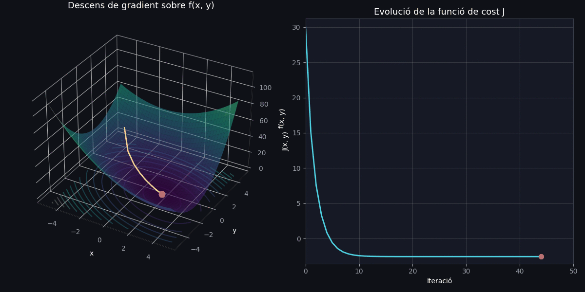
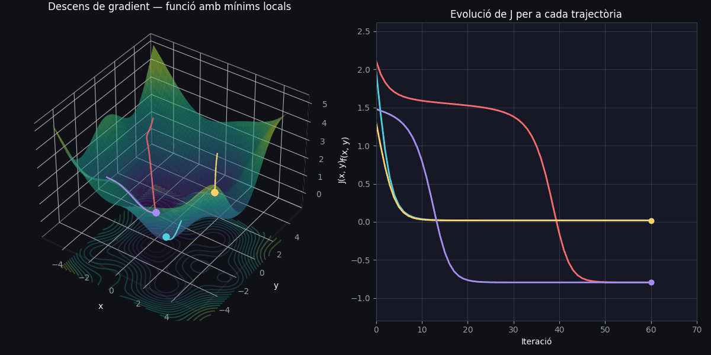

# 1. Models lineals

En aquest capítol repassarem els models lineals, un dels enfocaments més senzills i alhora fonamentals de l'aprenentatge automàtic. Malgrat la seva simplicitat, aquests models permeten introduir conceptes clau com la definició d'una funció de pèrdua o el procés d'optimització, que constitueixen la base sobre la qual s'edifiquen els models d'aprenentatge profund.

## Regressió lineal

Com el seu nom indica, la regressió lineal resol un problema de regressió. Dit d'una altra manera, l'objectiu és construir un sistema capaç d'agafar un vector $x \in \mathbb{R}^n$ com a entrada i predir el valor d'un escalar $y \in \mathbb{R}$ com a sortida. La sortida de la regressió lineal és una funció lineal de l'entrada. Sigui $\hat{y}$ el valor que el nostre model prediu que hauria de tenir $y$. Definim la sortida com:

$$\widehat{y} = b + \overset{n}{\sum_{j = 1}}w_{j} \cdot x_{j},$$

on $\widehat{y}$ és el valor de predicció, $\mathbf{w} = (w_{1},\ldots,w_{j},\ldots,w_{n})$ és el vector de paràmetres del model i $b$ és un paràmetre addicional denominat biaix. Sense aquest terme, la recta (o hiperplà, en dimensions més altes) que representa el model estaria obligada a passar sempre per l'origen de coordenades, és a dir, quan totes les entrades $x$ són zero, la predicció $\hat{y}$​ també seria necessàriament zero). Això és una restricció innecessària en la majoria de problemes reals.

Suposem que tenim un conjunt de dades extret d'una base de dades de vendes de habitatges. Podríem construir una taula, on cada fila correspon a una propietat immobiliària diferent, i cada columna correspon a alguna característica, com els metres quadrats, el nombre d'habitacions o de banys, les plantes, o la seva antiguitat. Aquesta taula seria el nostre conjunt de dades, i cada exemple seria una fila de la taula, que correspondria a una propietat immobiliària específica amb les seves característiques. El preu de l'immoble és l'etiqueta del valor desitjat i, per tant, partint de la suposició que aquest és una combinació lineal ponderada de les característiques de l'immoble podríem emprar el model de regressió previament descrit.

En aquest cas d'exemple és poc realista pensar que un pis de 0 $m^2$ costa 0 €. El terme de biaix permet que la recta de regressió talli l'eix vertical en un punt diferent de zero, oferint així molta més flexibilitat al model per ajustar-se a les dades reals.

Generalment, es reordena el paràmetre biaix perquè pugui ser ajustat de la mateixa manera que la resta de paràmetres i es defineix com el primer element del vector de paràmetres $(w_{0} = b$, i es ponderarà amb un valor d'entrada constant que és sempre 1 (a nivell de codi, augmentem el vector de característiques amb aquest valor 1). Així, el model quedaria:

$\widehat{y} = \overset{n}{\sum_{j = 0}}w_{j}x_{j}, \; \text{on} \; x_{0} = 1$.

Un cop tenim el conjunt de dades i el model, necessitem un algorisme capaç de trobar els millors paràmetres possibles per minimitzar la funció de pèrdua que, en els problemes de regressió, sol ser la diferència al quadrat entre la predicció i el valor desitjat:

$J(\mathbf{w}) = \frac{1}{2}(\widehat{y} - y)^{2}.$


## Descens de gradient

El gradient d'una funció escalar de diverses variables és un vector que conté totes les seves derivades parcials, i indica la direcció de màxim creixement de la funció en cada punt del seu domini.

El descens de gradient és un algoritme d'optimització iteratiu utilitzat per trobar el mínim (local o global) d'una funció. Sigui $J(\theta)$ una funció de cost (o pèrdua) diferenciable, on $\theta \in \mathbb{R}^n$ representa el vector de paràmetres del model que volem optimitzar. L'objectiu és trobar el valor de la variable $\theta$ que fa que la funció assoleixi el seu valor mínim:

$$\theta^* = \arg\min_{\theta} J(\theta).$$

El descens de gradient assoleix aquest objectiu actualitzant iterativament els paràmetres en la direcció oposada al gradient de la funció de cost, ja que el gradient $\nabla_\theta J(\theta)$ indica la direcció de màxim creixement de la funció. Movent-nos en la direcció oposada, ens acostem a un mínim.

La regla d'actualització dels paràmetres a cada iteració $t$ és:

$$\theta_{t+1} = \theta_t - \eta \, \nabla_\theta J(\theta_t)$$

on:

- $\theta_t \in \mathbb{R}^n$ són els paràmetres del model en la iteració $t$.
- $\eta > 0$ és la **taxa d'aprenentatge** (*learning rate*), un hiperparàmetre que controla la mida del pas a cada actualització.
- $\nabla_\theta J(\theta_t)$ és el gradient de la funció de cost respecte als paràmetres, avaluat en $\theta_t$.


De manera més explícita, per a cada component $\theta_i$ del vector de paràmetres:

$$\theta_i \leftarrow \theta_i - \eta \, \frac{\partial J(\theta)}{\partial \theta_i}.$$

L'algoritme s'atura quan es compleix algun criteri de convergència, per exemple:

$$\|\nabla_\theta J(\theta_t)\| < \epsilon,$$

on $\epsilon$ és un llindar (*threshold*) petit predefinit, o bé quan s'assoleix un nombre màxim d'iteracions.

### Un exemple pràctic

Donada la funció de dues variables $ f(x, y) = x^2 + 2y^2 + xy - 3x $ que es contínua i diferenciable a tot $\mathbb{R}^2$, aplicarem l'algorisme del descens del gradient de manera analítica seguint la regla d'actualització $\theta_{t+1} = \theta_t - \eta \, \nabla_\theta J(\theta_t)$, on $J$ és la funció $f$ i $\theta$ són $x, y$, els paràmetres de la funció.


Per aplicar el descens de gradient necessitem el gradient $\nabla f(x,y)$, és a dir, les dues derivades parcials. Per calcular la derivada parcial respecte a $x$, tractem $y$ com una constant:

$$\frac{\partial f}{\partial x} = \frac{\partial}{\partial x}\left(x^2 + 2y^2 + xy - 3x\right) = 2x + y - 3.$$
Farem el mateix per calcular la derivada parcial respecte a $y$, tractem $x$ com una constant:

$$\frac{\partial f}{\partial y} = \frac{\partial}{\partial y}\left(x^2 + 2y^2 + xy - 3x\right) = 4y + x.$$

El gradient de la funció és:

$$
\nabla f(x, y) = \begin{bmatrix} \dfrac{\partial f}{\partial x} \\[8pt] \dfrac{\partial f}{\partial y} \end{bmatrix} = \begin{bmatrix} 2x + y - 3 \\[4pt] 4y + x \end{bmatrix}
$$

A cada iteració $t$, els paràmetres $(x, y)$ s'actualitzen movent-se en la direcció oposada al gradient, escalada per la taxa d'aprenentatge $\eta$:

$$
\begin{bmatrix} x_{t+1} \\ y_{t+1} \end{bmatrix} = \begin{bmatrix} x_t \\ y_t \end{bmatrix} - \eta \begin{bmatrix} 2x_t + y_t - 3 \\ 4y_t + x_t \end{bmatrix}
$$

O de manera separada, component a component:

$$x_{t+1} = x_t - \eta\,(2x_t + y_t - 3).$$

$$y_{t+1} = y_t - \eta\,(4y_t + x_t).$$


Un cop tenim les derivades parcials l'algorisme en Python seria el següent:

```python
def f(x, y):
    return x**2 + 2*y**2 + x*y - 3*x

def grad_f(x, y):
    df_dx = 2*x + y - 3
    df_dy = 4*y + x
    return df_dx, df_dy

# Hiperparàmetres
x, y = punt_inicial_x, punt_inicial_y   # p. ex. (-3.5, 3.0)
eta = taxa_aprenentatge                 # p. ex. 0.15
n_iteracions = nombre_de_passes         # p. ex. 50
epsilon = llindar_convergencia          # p. ex. 1e-6

for t in range(n_iteracions):
    df_dx, df_dy = grad_f(x, y)

    # Criteri d'aturada: norma del gradient prou petita
    norma_gradient = (df_dx**2 + df_dy**2) ** 0.5
    if norma_gradient < epsilon:
        break

    # Actualització dels paràmetres
    x = x - eta * df_dx
    y = y - eta * df_dy

    # (opcional) registrar el cost per fer-ne seguiment
    cost_actual = f(x, y)

# En acabar el bucle, (x, y) és l'aproximació al mínim de f
```

El resultat d'aplicar l'algorisme durant 50 iteracions és el següent:





Biel: Això següent és necessari?

Com que $f$ és convexa només té un mínim, aquest es troba igualant el gradient a zero. Podem trobar la solució analítica i comprovar que és la mateixa que la que troba l'algorisme:

$$
\begin{cases} 2x + y - 3 = 0 \\ 4y + x = 0 \end{cases}
$$

De la segona equació: $x = -4y$. Substituint a la primera:

$$2(-4y) + y - 3 = 0 \;\Rightarrow\; -8y + y - 3 = 0 \;\Rightarrow\; -7y = 3 \;\Rightarrow\; y = -\frac{3}{7},$$

$$x = -4y = \frac{12}{7}.$$

Per tant, el mínim global s'assoleix a:

$$(x^*, y^*) = \left(\frac{12}{7}, -\frac{3}{7}\right) \approx (1.714,\ -0.429).$$

Aquest resultat coincideix amb el punt final que obtenia el descens de gradient a la simulació anterior.

Biel: Posar un exemple més complex? Només plantejar la funció i el resultat de l'algorisme, seria la imatge següent:





### Variants de l'algorisme

Val la pena aturar-nos en com s'aplica realment el descens de gradient a la pràctica, ja que hi ha diverses maneres d'utilitzar les dades disponibles a cada pas d'actualització, i aquesta decisió té un impacte important tant en la velocitat com en l'estabilitat de l'entrenament.

En el **batch gradient descent**, el gradient es calcula utilitzant tot el conjunt de dades d'entrenament a cada iteració, la qual cosa produeix una trajectòria de descens molt estable i precisa, però resulta extremadament costosa quan el conjunt de dades és gran, ja que cal processar-lo íntegrament abans de fer una sola actualització dels paràmetres.

A l'altre extrem trobem l'**stochastic gradient descent** (_SGD_), on el gradient s'estima a partir d'un únic exemple triat a l'atzar a cada iteració. Això permet actualitzacions molt més ràpides i fa possible aprendre de manera incremental, però introdueix molt soroll en l'estimació del gradient, de manera que la trajectòria d'aprenentatge esdevé força irregular i sol necessitar més iteracions per convergir de manera fiable.

El **mini-batch gradient descent** neix precisament com un compromís entre aquests dos extrems: en lloc d'utilitzar tot el conjunt de dades o un únic exemple, es calcula el gradient a partir d'un petit subconjunt de dades a cada pas anomenat _batch_. D'aquesta manera s'aconsegueix reduir considerablement el soroll respecte al _SGD_ pur, sense arribar al cost computacional del conjunt complet, i alhora s'aprofita molt millor el paral·lelisme del maquinari modern, com les GPU. Per aquest motiu, aquesta és l'estratègia més utilitzada en la pràctica a l'hora d'entrenar models d'aprenentatge profund.


## Regressió logística

Encara que els problemes de regressió poden tenir moltes aplicacions, com, per exemple, la quantitat de pluja que podria caure en un territori, les hores que pot durar una operació, el valor d'un jugador de futbol o l'evolució d'un valor de la borsa, la gran majoria d'aplicacions d'aprenentatge profund són de classificació, on volem que el nostre model observi les característiques, per exemple, els valors dels píxels d'una imatge, i tot seguit predigui a quina categoria (formalment anomenada classe), entre un conjunt discret d'opcions, pertany una nova mostra. Per exemple, per reconèixer dígits escrits a mà, tenim deu classes, corresponents als dígits del 0 al 9. 

Començarem amb la forma més simple de classificació, quan només hi ha dues classes, un tipus d'aplicació que anomenem classificació binària. En aquest cas, el nostre conjunt de dades podria consistir en imatges d'animals i les nostres etiquetes podrien ser les classes ca o moix, o bé, si les nostres mostres són correus electrònics, podríem classificar-los com a _spam_ o no _spam_.


El model més senzill és aquell que només retorna un valor binari, $\hat{y} = \{0, 1\}$, on $0$ correspondria a la classe "negativa" i $1$ a la classe "positiva". Utilitzant el model lineal anterior, podem usar els valors ponderats de paràmetres i característiques com a valor d'entrada d'una nova funció, que denominarem **funció d'activació**, el valor de sortida de la qual estigui entre $0$ i $1$:

$$\hat{y} = \sigma\!\left(\sum_{j=0}^{n} w_j x_j\right), \quad \text{on} \quad \sigma(z) = \frac{1}{1 + e^{-z}}.$$

Aquest model es denomina **regressió logística**, ja que la funció d'activació és la funció sigmoide (un cas particular de la funció logística).


<figure style="text-align: center;">
    
    <figcaption>Funció sigmoide.</figcaption>
</figure>

L'avantatge d'utilitzar aquesta funció és que és possible expressar el valor de la predicció com una probabilitat. Donades les característiques d'una mostra, aquest model assigna una probabilitat a cada classe possible. Tornant al nostre exemple de classificació d'animals, un classificador podria veure una imatge i generar la probabilitat que la imatge sigui un gat com a $0.9$. Podem interpretar aquest nombre dient que el classificador està un $90\%$ segur que la imatge representa un gat. La magnitud de la probabilitat de la classe pronosticada transmet una noció d'incertesa en la predicció realitzada.

(Biel: no m'agrada aquesta explicació que vé a continuació)

Per trobar la regla d'aprenentatge, podria semblar natural minimitzar l'error quadràtic, com hem fet en la regressió lineal. En classificació binària aquesta funció de pèrdua no és una bona elecció: el que volem és que el model assigni probabilitats properes a $1$ quan l'etiqueta és positiva, i properes a $0$ quan és negativa. L'error quadràtic penalitza poc les prediccions molt errònies i no reflecteix bé aquesta asimetria, per la qual cosa cal usar una funció de pèrdua diferent. En aquest tipus de problemes de classificació, la funció de pèrdua habitual s'anomena **entropia creuada** (*cross entropy*).

La funció de pèrdua de l'entropia creuada té la forma següent:

$$\mathcal{L}(\hat{y}, y) = \begin{cases} -\log \hat{y} & \text{si } y = 1 \\ -\log(1 - \hat{y}) & \text{si } y = 0 \end{cases}$$

Que es pot expressar de manera compacta com:

$$J(w) = -\, y \cdot \log \hat{y} \;-\; (1 - y) \cdot \log(1 - \hat{y})$$

De manera visual podem veure la funció de la següent manera:

<figure style="text-align: center;">
    
    <figcaption>Funció sigmoide.</figcaption>
</figure>

És a dir, si estem prop dels valors de cada classe, l'error és petit, mentre que creix exponencialment com més ens allunyem dels valors desitjats. Tot i que té un terme per a les mostres positives i un altre per a les mostres negatives, és fàcil combinar-los en una única funció de pèrdua sumant tots dos termes depenent de l'etiqueta que tinguem com a valor desitjat per a cada mostra. És fàcil comprovar que si el valor és $0$ ens quedarem amb el segon terme, i si el valor és $1$, ens quedarem amb el primer terme.

### Derivació del descens de gradient per a la regressió logística

Abans de derivar, és útil calcular la derivada de $\sigma(z)$, ja que apareixerà repetidament:

$$\sigma'(z) = \sigma(z)\,(1-\sigma(z)) = \hat{y}\,(1-\hat{y}).$$

Com veurem al final del proces, aquesta propietat fa que la derivació sigui especialment elegant.

A continuació volem calcular $\dfrac{\partial J}{\partial w_j}$. La cadena de dependències a l'hora de derivar és la següent: $w_j \;\longrightarrow\; z \;\longrightarrow\; \hat{y} \;\longrightarrow\; J$. Aplicarem la regla de la cadena de la següent manera:

$$\frac{\partial J}{\partial w_j} = \frac{\partial J}{\partial \hat{y}} \cdot \frac{\partial \hat{y}}{\partial z} \cdot \frac{\partial z}{\partial w_j}.$$

Realitzarem les derivades parcials una a una abans de concatenar-les. En primer lloc, cal realitzar la derivada de $J$ respecte a $\hat{y}$:

$$\frac{\partial J}{\partial \hat{y}} = -\frac{y}{\hat{y}} + \frac{1-y}{1-\hat{y}}.$$

En segon lloc la derivada de $\hat{y}$ respecte a $z$. Usant la propietat de la funció sigmoide (la seva derivada s'expressa en funció del seu propi valor) tenim que:

$$\frac{\partial \hat{y}}{\partial z} = \hat{y}\,(1-\hat{y}).$$

Finalment hem de calcular la derivada de $z$ respecte a $w_j$:

$$\frac{\partial z}{\partial w_j} = x_j.$$

Ara ja ens trobem en condicions de combinar les tres passes: 
$$\frac{\partial J}{\partial w_j} = \left(-\frac{y}{\hat{y}} + \frac{1-y}{1-\hat{y}}\right) \cdot \hat{y}\,(1-\hat{y}) \cdot x_j.$$

Desenvolupant el primer factor multiplicat pel segon:

$$\left(-\frac{y}{\hat{y}} + \frac{1-y}{1-\hat{y}}\right) \cdot \hat{y}\,(1-\hat{y}) = -y\,(1-\hat{y}) + (1-y)\,\hat{y},$$

$$= -y + y\hat{y} + \hat{y} - y\hat{y} = \hat{y} - y.$$

Per tant, el gradient queda de la següent manera:

$$\frac{\partial J}{\partial w_j} = (\hat{y} - y)\, x_j.$$

Aplicant la regla del descens de gradient que ja coneixem, l'actualització d'un pes vé donada per: $w_j \leftarrow w_j - \eta \dfrac{\partial J}{\partial w_j}$:

$$w_j = w_j - \eta\,(\hat{y} - y)\, x_j$$

O de manera equivalent (canviant el signe):

$$w_j = w_j + \eta\,(y - \hat{y})\, x_j$$

Aquesta regla d'actualització té exactament la mateixa forma que la de la regressió lineal. La diferència és que aquí $\hat{y} = \sigma(z)$ és la sortida de la sigmoide, mentre que en la regressió lineal $\hat{y} = w^\top x$ és directament la combinació lineal. És a dir, la forma de la regla d'aprenentatge és la mateixa, però el valor de $\hat{y}$ que s'hi substitueix és diferent en cada model. Aquest resultat no és casual, és una conseqüència directa d'haver escollit l'entropia creuada com a funció de pèrdua per a un model amb sortida sigmoide.


## Conclusions

Els models lineals senzills ens han servit per comprendre com es defineix un model de manera matemàtica, en aquest cas assumint que la predicció és una combinació lineal de paràmetres i característiques de les dades, i com es defineixen les funcions de pèrdua per als problemes de regressió (diferència de l'error al quadrat) i de classificació (entropia creuada). A més, hem pogut conèixer com es defineixen les regles d'aprenentatge a partir de l'aplicació del mètode d'optimització del descens del gradient a la funció de pèrdua. Aquests conceptes, tot i que els hem vist amb models senzills (encara que són models clàssics d'aprenentatge automàtic molt utilitzats a les empreses), són els conceptes bàsics sobre els quals es construeixen els complexos models d'aprenentatge profund.

