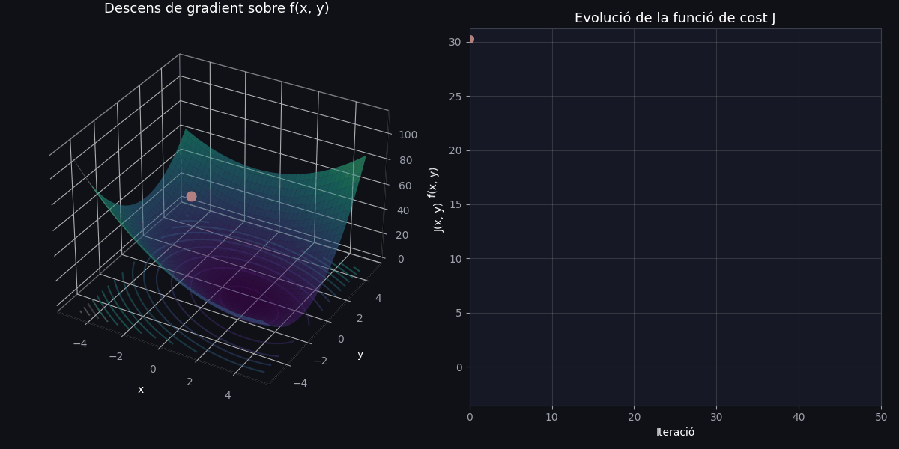
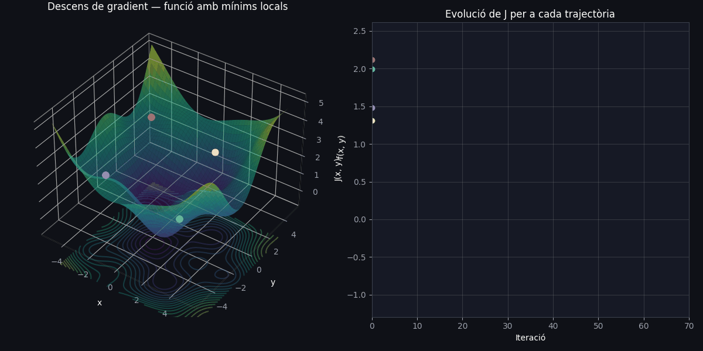

# Descens de gradient

El gradient d'una funció escalar de diverses variables és un vector que conté totes les seves derivades parcials, i indica la direcció de màxim creixement de la funció en cada punt del seu domini.

El descens de gradient és un algoritme d'optimització iteratiu utilitzat per trobar el mínim (local o global) d'una funció. Sigui $J(\theta)$ una funció de cost (o pèrdua) diferenciable, on $\theta \in \mathbb{R}^n$ representa el vector de paràmetres del model que volem optimitzar. L'objectiu és trobar el valor de la variable $\theta$ que fa que la funció assoleixi el seu valor mínim:

$$\theta^* = \arg\min_{\theta} J(\theta).$$

El descens de gradient assoleix aquest objectiu actualitzant iterativament els paràmetres en la direcció oposada al gradient de la funció de cost, ja que el gradient $\nabla_\theta J(\theta)$ indica la direcció de màxim creixement de la funció. Movent-nos en la direcció oposada, ens acostem a un mínim.

La regla d'actualització dels paràmetres a cada iteració $t$ és:

$$\theta_{t+1} = \theta_t - \eta \nabla_\theta J(\theta_t),$$

on:

- $\theta_t \in \mathbb{R}^n$ són els paràmetres del model en la iteració $t$.
- $\eta > 0$ és la **taxa d'aprenentatge** (*learning rate*), un hiperparàmetre que controla la mida del pas a cada actualització.
- $\nabla_\theta J(\theta_t)$ és el gradient de la funció de cost respecte als paràmetres, avaluat en $\theta_t$.


De manera més explícita, per a cada component $\theta_i$ del vector de paràmetres:

$$\theta_i \leftarrow \theta_i - \eta \, \frac{\partial J(\theta)}{\partial \theta_i}.$$

L'algoritme s'atura quan es compleix algun criteri de convergència, per exemple:

$$\|\nabla_\theta J(\theta_t)\| < \epsilon,$$

on $\epsilon$ és un llindar (*threshold*) petit predefinit, o bé quan s'assoleix un nombre màxim d'iteracions.

## Un exemple pràctic

Donada la funció de dues variables $f(x, y) = x^2 + 2y^2 + xy - 3x$ que és contínua i diferenciable a tot $\mathbb{R}^2$. Aplicarem l'algorisme del descens del gradient de manera analítica seguint la regla d'actualització $\theta_{t+1} = \theta_t - \eta \, \nabla_\theta J(\theta_t)$, on $J$ és la funció $f$ i $\theta$ són $x, y$, els paràmetres de la funció.


Per aplicar el descens de gradient necessitem el gradient $\nabla f(x,y)$, és a dir, les dues derivades parcials. Per calcular la derivada parcial respecte a $x$, tractem $y$ com una constant:

$$\frac{\partial f}{\partial x} = \frac{\partial}{\partial x}\left(x^2 + 2y^2 + xy - 3x\right) = 2x + y - 3.$$

Farem el mateix per calcular la derivada parcial respecte a $y$, tractem $x$ com una constant:

$$\frac{\partial f}{\partial y} = \frac{\partial}{\partial y}\left(x^2 + 2y^2 + xy - 3x\right) = 4y + x. $$

El gradient de la funció és:

$$
\nabla f(x, y) = \begin{bmatrix} \dfrac{\partial f}{\partial x} \dfrac{\partial f}{\partial y} \end{bmatrix} = \begin{bmatrix} 2x + y - 3 \\ 4y + x \end{bmatrix}
$$

A cada iteració $t$, els paràmetres $(x, y)$ s'actualitzen movent-se en la direcció oposada al gradient, escalada per la taxa d'aprenentatge $\eta$:

$$
\begin{bmatrix} x_{t+1} \\ y_{t+1} \end{bmatrix} = \begin{bmatrix} x_t \\ y_t \end{bmatrix} - \eta \begin{bmatrix} 2x_t + y_t - 3 \\ 4y_t + x_t \end{bmatrix}
$$

O de manera separada, component a component:

$$x_{t+1} = x_t - \eta\,(2x_t + y_t - 3).$$

$$y_{t+1} = y_t - \eta\,(4y_t + x_t). $$


Un cop tenim les derivades parcials podem construir l'algorisme en llenguatge Python per automatitzar el procés:

```python
def f(x, y):
    return x**2 + 2*y**2 + x*y - 3*x

def grad_f(x, y):
    df_dx = 2*x + y - 3
    df_dy = 4*y + x
    return df_dx, df_dy

# Hiperparàmetres
x, y = punt_inicial_x, punt_inicial_y   # p. ex. (-3.5, 3.0)
eta = taxa_aprenentatge                 # p. ex. 0.15
n_iteracions = nombre_de_passes         # p. ex. 50
epsilon = llindar_convergencia          # p. ex. 1e-6

for t in range(n_iteracions):
    df_dx, df_dy = grad_f(x, y)

    # Criteri d'aturada: norma del gradient prou petita
    norma_gradient = (df_dx**2 + df_dy**2) ** 0.5
    if norma_gradient < epsilon:
        break

    # Actualització dels paràmetres
    x = x - eta * df_dx
    y = y - eta * df_dy

    # (opcional) registrar el cost per fer-ne seguiment
    cost_actual = f(x, y)

# En acabar el bucle, (x, y) és l'aproximació al mínim de f
```

El resultat d'aplicar l'algorisme durant 50 iteracions és el següent:





Codi Python disponible en el següent [enllaç](../assets/gradient_descent/gradient_descent.zip).

### Solució analítica

Com que $f$ és convexa només té un mínim, aquest es troba igualant el gradient a zero. Podem trobar la solució analítica i comprovar que és la mateixa que la que troba l'algorisme:

$$
\begin{cases} 2x + y - 3 = 0 \\ 4y + x = 0 \end{cases}
$$

De la segona equació: $x = -4y$. Substituint a la primera:

$$2(-4y) + y - 3 = 0 \;\Rightarrow\; -8y + y - 3 = 0 \;\Rightarrow\; -7y = 3 \;\Rightarrow\; y = -\frac{3}{7},$$

$$x = -4y = \frac{12}{7}. $$

Per tant, el mínim global s'assoleix a:

$$(x^{\ast}, y^{\ast}) = \left(\frac{12}{7}, -\frac{3}{7}\right) \approx (1.714, -0.429). $$

Aquest resultat coincideix amb el punt final que obtenia el descens de gradient a la simulació anterior.

## Un exemple més complex

La funció de l'exemple anterior és simple (té dos paràmetres) i només té un mínim. Per tant, el podíem trobar de forma analítica, en canvi, la funció $f(x, y) = sin(x) * cos(y) + 0.1*(x^2 + y^2)$ no té una solució analítica tancada. En aquest cas, aplicant l'algorisme del descens del gradient podem intentar trobar-ho. 

En el següent gràfic podem veure com evoluciona l'algorisme depenent del punt d'inici:




[Codi Python disponible](../assets/gradient_descent_multi/gradient_descent_multi.zip).