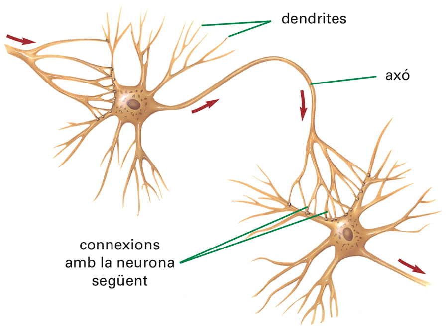
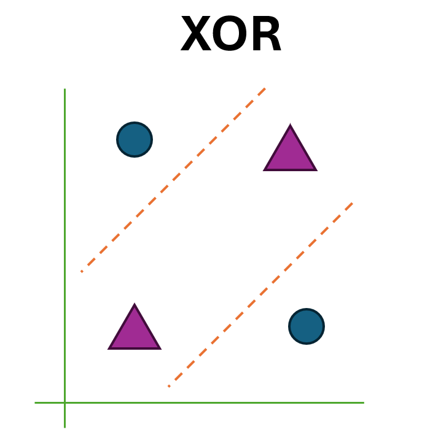
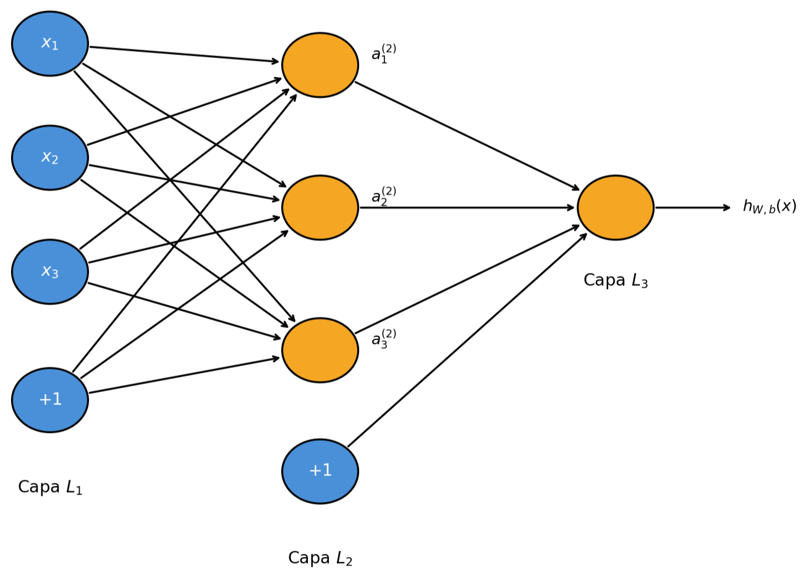
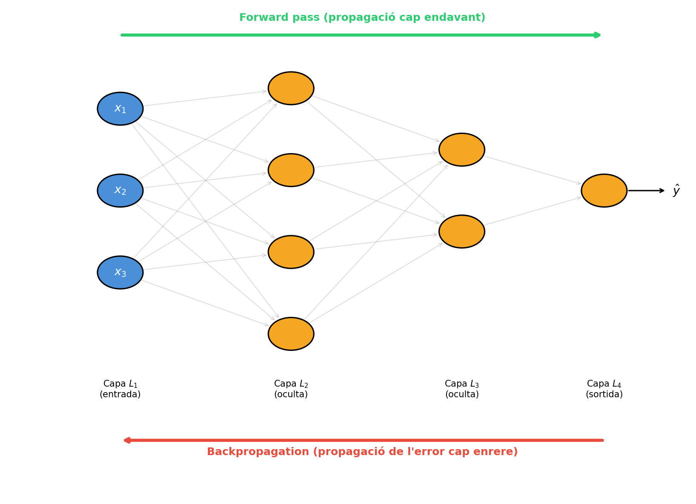

# El Perceptró

El cervell humà està format per una substància grisa que conté aproximadament 100.000 milions de neurones, cèl·lules nervioses especialitzades en la transmissió d'informació entre el cervell i la resta del cos, interconnectades formant una xarxa de comunicació d'una complexitat extraordinària.

{width=300px}

Com es veu a la figura anterior, cada neurona té múltiples connexions amb altres cèl·lules per mitjà de la sinapsi, que és una reacció química entre el senyal elèctric generat al nucli de la cèl·lula, que quan rep prou connexions per mitjà d'unes terminacions denominades dendrites, es transmet per l'axó cap a les neurones següents.

L'any 1958, al Laboratori Aeronàutic de Cornell, el psicòleg Frank Rosenblatt va crear el **Perceptró** inspirant-se en el funcionament de les neurones (Rosenblatt, 1958). Aquest model es basa en la definició d'una neurona artificial:

El valor de les entrades, $\textbf{x}$, es pondera per uns pesos, $\textbf{w}$, i s'acumula al nucli de la neurona artificial per mitjà de la funció neta:

$$net = \sum_{j=1}^{n} w_j x_j,$$

quan l'entrada neta és major o igual que un valor de llindar, $\theta$, la sortida, $y$, és igual a $1$; si no, la sortida valdria $0$.

Per entendre el seu funcionament, vegem primer un exemple de com funcionaria un Perceptró com una porta lògica AND. Si recordem la definició de la Regressió logística del capítol anterior:

$$\hat{y} = f\left(\sum_{j=0}^{n} w_j x_j\right), \quad \text{on} \quad f(z) = \frac{1}{1+e^{-z}},$$

podríem veure el Perceptró com un model de classificació lineal on la funció d'activació seria la funció llindar en lloc de la Regressió logística:

$$\hat{y} = f\left(\sum_{j=1}^{n} w_j x_j\right), \quad \text{on} \quad f(z) = \begin{cases} 1 & \text{si } z \geq \theta \\ 0 & \text{si } z < \theta \end{cases}.$$

Aquesta expressió es pot modificar per convertir el llindar en el valor biax d'aquest model mitjançant la convenció $b = -\theta$, $x_0 = 1$, el model queda de la següent manera:

$$\hat{y} = \begin{cases} 1 & \text{si } \displaystyle\sum_{j=0}^{n} w_j x_j \geq 0 \\ 0 & \text{si no} \end{cases} $$

Per actualitzar els pesos mitjançant el descens del gradient, necessitem calcular la derivada de la funció d'activació. Això representa un problema fonamental en el Perceptró, ja que la funció llindar no és diferenciable: és constant a tot arreu excepte en $z=0$, on presenta una discontinuïtat. En conseqüència, el seu gradient és zero gairebé a tot el domini, cosa que fa impossible que el descens del gradient pugui ajustar els pesos de manera significativa. Aquesta limitació va ser precisament la que va motivar la recerca de funcions d'activació alternatives, com la sigmoide, que aproximen el comportament de la funció llindar d'una manera suau i diferenciable a tot arreu.

En lloc de derivar la funció llindar, Rosenblatt va proposar una regla d'actualització directa basada en l'error comès:

$$w_j = w_j + \eta (y - \hat{y}) \cdot x_j, $$

Aquesta regla té una interpretació intuïtiva molt clara. Si el model encerta la predicció, $(y - \hat{y}) = 0$ els pesos no es modifiquen. Si el model prediu $\hat{y} = 0$ però la resposta correcta és $y = 1$, aleshores $(y - \hat{y}) = 1$ i els pesos augmenten en la direcció de $x_j$. Si el model prediu $\hat{y} = 1$ però la resposta correcta és $y = 0$, aleshores $(y - \hat{y}) = -1$ i els pesos disminueixen. Tal com succeeix en els models lineals, l'hiperparàmetre $\eta$ té un valor major a zero i serveix per controlar com s'actualitza el pes $w_j$ respecte a l'error. Aquesta és la mateixa regla que la dels models lineals descrits anteriorment.

 A partir del model teòric del Perceptró, es va construir el **Perceptron Mark 1**, un ordinador dissenyat per al reconeixement d'imatges que tenia una matriu de 400 fotocèl·lules connectades aleatòriament a una implementació electrònica de les neurones artificials; els pesos es codificaven en potenciòmetres i les actualitzacions dels pesos durant l'aprenentatge es realitzaven mitjançant motors elèctrics.

> *The New York Times* va informar que el perceptró era "l'embrió d'un ordinador electrònic que [la Marina] espera que sigui capaç de caminar, parlar, veure, escriure, reproduir-se i ser conscient de la seva existència."
>
> Mikel Olazarán (1996). "A Sociological Study of the Official History of the Perceptrons Controversy". *Social Studies of Science*. 26(3): 611–659.

Tanmateix, malgrat l'expectació generada per aquest model, la publicació del llibre *Perceptrons* (Minski and Papert, 1969) va provocar un abandonament en el finançament de la recerca en xarxes neuronals artificials. En aquest llibre es demostrava que el Perceptró no era capaç de resoldre un problema senzill com el de la porta lògica XOR.

{width=300px}

Com es pot observar a la figura anterior, s'arriba a una contradicció en la derivació matemàtica del problema. Si ens fixem en la seva representació gràfica, podem comprovar com no és possible separar els exemples de les dues classes mitjançant una única recta.

En general, els models lineals de classificació, com el Perceptró, només poden resoldre aplicacions de classificació on els exemples de cada classe puguin separar-se per un hiperplà (una recta $n$-dimensional). Tanmateix, si ens fixem en la representació gràfica de la funció XOR, si tinguéssim la capacitat de definir dues rectes de separació, és a dir, definir dos Perceptrons, podríem resoldre aquest problema de manera més senzilla.

De nou, inspirant-se en el comportament del cervell humà, on les neurones no actuen de manera aïllada sinó organitzades en capes interconnectades, la solució natural a la limitació del Perceptró simple és apilar diverses capes de neurones, donant lloc al Perceptró multicapa. Amb aquesta arquitectura, els problemes linealment no separables poden resoldre's, ja que cada capa addicional permet aprendre representacions cada cop més complexes de les dades. Tanmateix, aquest avenç teòric va quedar paralitzat durant gairebé dues dècades: no va ser fins al 1986 que Rumelhart, Hinton i Williams van publicar l'algoritme backpropagation, que per primera vegada oferia una regla d'aprenentatge pràctica i eficient per a xarxes de múltiples capes. Aquest algoritme, que veurem en el següent tema, és la pedra angular de l'aprenentatge profund modern.

## El Perceptró multicapa

De la mateixa manera que el cervell humà no funciona amb una única neurona aïllada sinó amb milers de milions d'elles organitzades en estructures complexes, la solució natural a aquesta limitació és connectar múltiples Perceptrons entre si, formant el que es coneix com a Perceptró multicapa o xarxa neuronal.

A continuació tenim l'esquema general del perceptró multicapa:

{width=300px}

En aquesta figura, hem usat cercles blaus per indicar les entrades a la xarxa. Els cercles etiquetats com a $+1$ són les unitats associades al valor del biaix, que ja havíem vist en els models lineals. La capa més a l'esquerra de la xarxa es denomina **capa d'entrada**, i la capa més a la dreta, la **capa de sortida** que, en aquest exemple, només té una neurona. La capa intermèdia de neurones es denomina **capa oculta**, perquè els seus valors no són observables durant l'entrenament. Per definir l'arquitectura del nostre model podem dir que la nostra xarxa neuronal té 3 unitats d'entrada (sense comptar la unitat de biaix), 3 unitats ocultes i 1 unitat de sortida.

### Notació formal

Si $n_l$ és el nombre de capes a la nostra xarxa, etiquetarem la capa $L$ com $L_l$, de manera que la capa $L_1$ seria la capa d'entrada i la capa $L_{n_l}$ la de sortida (la capa $L_3$ en el nostre exemple).

Escrivim $W_{ij}^{(l)}$ per indicar el pes (o paràmetre) associat amb la connexió entre la unitat $j$ de la capa $l$ i la unitat $i$ a la capa $l+1$. A més, $b_i^{(l)}$ és el biaix associat a la unitat $i$ de la capa $l+1$. En aquest cas, tal com es pot observar a la figura, les unitats associades als biaixos no tenen connexions amb la capa anterior. Finalment, escriurem $a_i^{(l)}$ per indicar el valor d'activació (és a dir, el valor de sortida) de la unitat $i$ a la capa $l$ (així, usaríem $a_i^{(1)} = x_i$ per indicar la $i$-èsima entrada). Donada una configuració de paràmetres $\{\mathbf{W}^{(l)}, \mathbf{b}^{(l)}\}, l = 1, \ldots, n_l - 1$, la nostra xarxa neuronal defineix una hipòtesi $h_{\mathbf{W},\mathbf{b}}$ que és el valor de sortida de la xarxa (un nombre real).

### Propagació cap endavant

 La propagació cap endavant és el nom que donem a com es calcula el valor de sortida de la xarxa neuronal. Si definim $z_i^{(l)}$ com la suma total ponderada de les entrades a la unitat $i$ a la capa $l$ (inclòs el biaix), tindríem el valor d'entrada neta del Perceptró, de manera que per calcular el valor de sortida de la unitat, només caldria aplicar la funció d'activació, $f$, de manera que $a_i^{(l)} = f(z_i^{(l)})$.

En general, recordant que també usem $a_i^{(1)} = x_i$ per denotar els valors de la capa d'entrada, donades les activacions de la capa $l$, $a_i^{(l)}$, podem calcular les activacions de la capa $l+1$, $a_i^{(l+1)}$, com:

$$z_i^{(l+1)} = \sum_{j=1}^{s_l} W_{ij} \, a_j^{(l)} + b_i^{(l)},$$

$$a_i^{(l)} = f\!\left(z_i^{(l)}\right),$$

on $s_l$ és el nombre d'unitats de la capa $l$, i $f$ és la funció d'activació. Aplicant de manera recursiva aquestes fórmules podem calcular el valor de les unitats de sortida de qualsevol arquitectura de xarxa neuronal. Tots aquests càlculs es poden realitzar de manera paral·lela com a producte de matrius i vectors, que podem generalitzar usant el concepte de tensor, origen de l'expansió d'aquests models gràcies a l'aparició de plataformes de maquinari (com les GPU de NVIDIA) i programari (com les biblioteques TensorFlow o Pytorch) que faciliten l'aplicació i la programació d'aquests models.

### De les xarxes de Perceptrons a les neurones sigmoide

L'objectiu de l'algorisme d'aprenentatge és que un canvi petit en els pesos o els biaixos produeixi un canvi petit i controlat en la sortida de la xarxa. Això és imprescindible per poder ajustar gradualment els pesos en la direcció correcta.

El problema és que el Perceptró utilitza la funció escaló com a activació, i aquesta és discontínua: un canvi petit en $w_j$ o $b$ pot fer que la sortida d'una neurona passi ràpidament de $0$ a $1$. Aquest salt pot propagar-se de manera impredictible per tota la xarxa, fent impossible controlar l'efecte dels canvis sobre la sortida final. En conseqüència, no es pot aprendre de manera gradual.

La neurona sigmoide substitueix la funció escaló per la funció sigmoide de manera que la sortida de la neurona és:

$$\hat{y} = \sigma\!\left(\sum_j w_j x_j + b\right) = \frac{1}{1+\exp\!\left(-\displaystyle\sum_j w_j x_j - b\right)}.$$

A diferència del Perceptró, les entrades $x_j$ poden prendre qualsevol valor real entre $0$ i $1$, i la sortida també és un valor continu entre $0$ i $1$.

La clau no és la forma algebraica concreta de $\sigma$, sinó la seva suavitat. Aquesta és una versió contínua i diferenciable de la funció escaló. Això té una conseqüència matemàtica fonamental: un canvi petit $\Delta w_j$ en els pesos i $\Delta b$ en el bias produeix un canvi petit i predible en la sortida:

$$\Delta \hat{y} \approx \sum_j \frac{\partial \hat{y}}{\partial w_j} \Delta w_j + \frac{\partial \hat{y}}{\partial b} \Delta b$$

Aquesta expressió diu que $\Delta \hat{y}$ és una funció lineal dels canvis $\Delta w_j$ i $\Delta b$. Això fa possible calcular exactament quan i en quina direcció cal modificar cada pes per aconseguir el canvi desitjat en la sortida, que és precisament el que permet aprendre.

Per altra banda, com que la sortida de la neurona sigmoide és un valor continu entre $0$ i $1$, es pot interpretar com una probabilitat. En classificació binària, es pot fixar un llindar de decisió (habitualment $0.5$) per obtenir una predicció discreta:

$$\hat{y} \geq 0.5 \;\Rightarrow\; \text{classe positiva}, \qquad \hat{y} < 0.5 \;\Rightarrow\; \text{classe negativa}$$

Com veurem a continuació, aquesta no és l'única funció d'activació possible, però té una propietat especialment convenient: la seva derivada s'expressa en funció del seu propi valor, cosa que simplifica enormement els càlculs del descens del gradient i el *backpropagation*.

Recordem: 

$$\sigma'(z) = \sigma(z)\,(1-\sigma(z)).$$

### Funcions d'activació

Com ja sabem, la funció d'activació és un element fonamental de cada neurona artificial, ja que és la responsable de transformar la suma ponderada de les entrades (la funció neta $z$) en el valor de sortida de la neurona. 

Sense una funció d'activació, una xarxa neuronal, independentment del nombre de capes que tingui, es reduiria a una simple combinació lineal de les entrades, i per tant seria equivalent a un únic model lineal. És precisament la funció d'activació la que introdueix la no-linealitat al model, i aquesta és el que permet a les xarxes neuronals profundes aprendre representacions complexes de les dades i resoldre problemes que cap model lineal podria abordar. En funció de la tasca que ha de realitzar la xarxa i de la capa on s'aplica, existeixen diverses funcions d'activació amb propietats diferents, cadascuna amb els seus avantatges i inconvenients, que veurem a continuació.

1. **Sigmoide:**

És la funció d'activació més emprada en problemes de classificació binaria. Com es pot veure, la seva derivada és senzilla i queda expressada en forma de la funció original. Aquest fet estalvia càlculs, ja que la derivada de la funció d'activació és necessària en la regla d'aprenentatge basada en el descens del gradient.

$$f(z) = \frac{1}{1+e^{-z}}, \qquad f'(z) = f(z) \cdot (1 - f(z)).$$

2. **Tangent hiperbòlica:**

 Una altra opció similar, però quan el valor de sortida està entre $-1$ i $1$, és la funció tangent hiperbòlica, o *tanh*.

$$f(z) = \frac{e^{z} - e^{-z}}{e^{z} + e^{-z}}, \qquad f'(z) = 1 - f^2(z)$$

3.  **Softmax:**

Les dues funcions anteriors són útils quan tenim una sola sortida en un problema de classificació binària; tanmateix, en un problema de classificació en múltiples categories, sol usar-se una unitat de sortida que s'activa per a cada categoria. En aquest cas, s'usa la funció d'activació *softmax*, el valor de la qual depèn dels valors de totes les unitats de sortida i és una generalització de la funció logística per al cas multiclasse. Dit de manera més senzilla, associa probabilitats a cada classe i, per tant, podem saber la probabilitat que l'entrada pertanyi a cadascuna de les categories de sortida; si haguéssim d'escollir, la sortida seria aquella que té més probabilitat.

$$f(z)_i = \frac{e^{z_i}}{\displaystyle\sum_{k=1}^{K} e^{z_k}}, \quad \text{per a } i = 1, \ldots, K, \quad \mathbf{z} = (z_1, \ldots, z_K)$$

A continuació, veurem un exemple numèric de la funció d'activació softmax:

Suposem que tenim una xarxa neuronal de classificació amb 5 classes (per exemple, reconeixement de dígits del 0 al 4), i que a la capa de sortida obtenim el següent vector de valors nets $z = (2.1, 1.3, 0.5, -0.8,  3.2)$.

En primer lloc, s'ha de calcular $e^{z_k}$ per a cada component:

$$e^{2.1} = 8.166, \quad e^{1.3} = 3.669, \quad e^{0.5} = 1.649, \quad e^{-0.8} = 0.449, \quad e^{3.2} = 24.533$$

En segon lloc, cal calcular la suma total:

$$\sum_{k=1}^{5} e^{z_k} = 8.166 + 3.669 + 1.649 + 0.449 + 24.533 = 38.466$$

Finalment, Dividir cada $e^{z_k}$ per la suma

$$f(z)_1 = \frac{8.166}{38.466} = 0.212$$

$$f(z)_2 = \frac{3.669}{38.466} = 0.095$$

$$f(z)_3 = \frac{1.649}{38.466} = 0.043$$

$$f(z)_4 = \frac{0.449}{38.466} = 0.012$$

$$f(z)_5 = \frac{24.533}{38.466} = 0.638$$

Podem veure el resultat en la següent taula:

| Classe | $z_k$ | $e^{z_k}$ | $f(z)_k$ (probabilitat) |
|---|---|---|---|
| 0 | $2.1$ | $8.166$ | $21.2\%$ |
| 1 | $1.3$ | $3.669$ | $9.5\%$ |
| 2 | $0.5$ | $1.649$ | $4.3\%$ |
| 3 | $-0.8$ | $0.449$ | $1.2\%$ |
| 4 | $3.2$ | $24.533$ | $\mathbf{63.8\%}$ |

El model assigna una probabilitat del $63.8\%$ a la classe 4, que seria la predicció final del model. Observa com la softmax amplifica les diferències: tot i que $z_5 = 3.2$ és només $1.1$ unitats més gran que $z_1 = 2.1$, la probabilitat assignada és tres vegades més gran ($63.8\%$ vs $21.2\%$). Això és conseqüència directa de la funció exponencial, que magnifica les diferències entre els valors d'entrada.

4. **Funció Lineal Rectificada** (*ReLU*):

Recerques recents han trobat una funció d'activació diferent, la ReLU (per les seves sigles en anglès), que funciona millor a la pràctica a les capes ocultes de les xarxes neuronals profundes. Aquesta funció d'activació és diferent de la sigmoide i la *tanh* perquè no està limitada ni és contínuament diferenciable, que és una de les condicions "teòriques" que han de complir aquestes funcions per poder ser usades en el descens del gradient.

$$f(z) = \max(0, z) = \begin{cases} z & \text{si } z > 0 \\ 0 & \text{si no} \end{cases}, \qquad f'(z) = \begin{cases} 1 & \text{si } z > 0 \\ 0 & \text{si } z < 0 \end{cases}$$

Com podem veure, en el cas de $z = 0$, la derivada pot ser $0$ o $1$ indistintament. En la pràctica, les implementacions de les biblioteques (PyTorch o TensorFlow) simplement trien un valor concret per convenció.

### Funcions de pèrdua

Tal com hem explicat al capítol anterior amb els models lineals. Per mesurar l'error, cal una funció de pèrdua. La funció de pèrdua indica a la màquina com de lluny està la combinació de pesos i biaixos de la solució òptima. Hi ha moltes funcions de pèrdua que es poden usar en xarxes neuronals; l'error quadràtic mitjà (_Mean Squared Error_, MSE) i l'entropia creuada (_Cross Entropy Loss_) són dues de les més habituals.

#### Funció de pèrdua Error Quadràtic Mitjà (_MSE_):

$$\text{MSE Loss} =  \frac{1}{2} \, (y - \hat{y})^2.$$

#### Funció de pèrdua d'entropia creuada (binària)

Coneguda amb el nom de Binary Cross Entropy (_BCE_):

$$\text{BCE Loss} =  -\, y \cdot \log \hat{y} \;-\; (1 - y) \cdot \log(1 - \hat{y}).$$

#### Funció de pèrdua d'entropia creuada (multiclasse):

Més coneguda pel seu nom en anglès _Cross Entropy_; Quan el problema de classificació té més de dues classes, la fórmula anterior es generalitza sumant sobre totes les $K$ classes possibles. Per a un exemple amb etiqueta real $y$ (en format *one-hot*) i predicció $\hat{y}$ (obtinguda, per exemple, amb la funció *softmax*):

$$\text{Cross Entropy Loss} = -\sum_{k=1}^{K} y_k \log(\hat{y}_k),$$

on $K$ és el nombre total de classes, $y_k$ val $1$ si $k$ és la classe correcta i $0$ en cas contrari, i $\hat{y}_k$ és la probabilitat que el model assigna a la classe $k$.

## L'algoritme *backpropagation*

En l'explicació del Perceptró hem vist que, tot i que era conegut que els problemes linealment no separables, com el de la porta lògica XOR, es podien resoldre amb una xarxa neuronal multicapa, no va ser fins al 1986 que Rumelhart, Hinton i Williams van definir un algoritme d'aprenentatge per a aquest tipus de models: l'algoritme  _backpropagation_.

El problema que impedia aplicar el descens del gradient als models multicapa és el següent: la funció de pèrdua només es pot calcular a l'última capa, ja que és allà on tenim tant el valor de sortida de la xarxa com el valor desitjat, i per tant podem comparar-los per mesurar l'error. Però, quin seria el valor desitjat d'una unitat de les capes ocultes? No ho sabem, perquè les capes ocultes no produeixen una sortida directament observable ni comparable amb cap etiqueta del conjunt d'entrenament. Aquest és precisament el problema que _backpropagation_ resol de manera elegant.

La idea bàsica de l'algoritme _backpropagation_ és que és possible calcular el valor de la funció de pèrdua de les unitats de l'última capa i propagar-lo cap enrere, fins a arribar a les unitats de la primera capa oculta.

Així, l'algoritme seria el següent:

1. Fer un pas de propagació cap endavant, calculant les activacions per a totes les unitats de la xarxa neuronal fins a arribar a la capa de sortida, $L_{n_l}$.

2. Per a cada unitat de sortida $i$ de la capa $n_l$ (la capa de sortida), calculem el valor de la funció de pèrdua per la derivada de la funció d'activació, que correspondrà a l'error comès per la unitat $i$ de sortida, $\delta_i^{(n_l)}$.

    $$\delta_i^{(n_l)} = \frac{\partial \mathcal{L}}{\partial a_i^{(n_l)}} \, f'\!\left(z_i^{(n_l)}\right). $$

    - Per a la resta de capes, des de la capa $n_l - 1$ fins a la capa $1$, propagaríem els termes d'error cap enrere:

$$\delta_i^{(l)} = \left(\sum_{k=1}^{s_{l+1}} W_{ki}^{(l)} \, \delta_k^{(l+1)}\right) \cdot f'\!\left(z_i^{(l)}\right).$$

3. Finalment, una vegada calculats tots els errors de totes les unitats, les regles d'ajust de tots els pesos i biaixos de la xarxa neuronal serien:

$$W_{ij}^{(l)} = W_{ij}^{(l)} - \eta \, a_j^{(l)} \, \delta_i^{(l+1)},$$

$$b_i^{(l)} = b_i^{(l)} - \eta \, \delta_i^{(l+1)}.$$

A la figura següent es pot veure de manera gràfica com el càlcul dels termes d'error de cada unitat es calcula de manera inversa al càlcul de la predicció, començant per l'error a l'última capa (que podem calcular fàcilment a partir de la funció de pèrdua) fins als termes d'error de la primera capa oculta.

{width=200}

### Adaptació de l'algorisme a diverses funcions de pèrdua

L'algorisme que hem vist a la secció anterior és genèric per qualsevol funció de pèrdua que puguem emprar. El terme $\frac{\partial \mathcal{L}}{\partial a_i^{(n_l)}}$ a l'equació de càlcul de l'error de la darrera capa, $\delta_i^{(n_l)}$, és genèric, cada funció de pèrdua té una derivada diferent. 

Per altra banda, en la mateixa equació, l'expressió $f'\!\left(z_i^{(n_l)}\right)$ indica que hem de calcular la derivada de la funció d'activació respecte al valor net de la neurona. Com ja sabem, les funcions d'activació i pèrdua es troben molt relacionades amb l'arquitectura i el problema a resoldre. En aquesta secció veurem com és l'expressió  per les funcions de pèrdua més emprades.

#### Error quadràtic mitjà

 - Error per a l'última capa:

$$\delta_i^{(n_l)} = \frac{\partial \mathcal{L}}{\partial a_i^{(n_l)}} \, f'\!\left(z_i^{(n_l)}\right) = \left(a_i^{(n_l)} - y\right) f'\!\left(z_i^{(n_l)}\right).$$

- Regla d'actualització per a l'última capa:

$$W_{ij}^{(l)} = W_{ij}^{(l)} - \alpha \frac{\partial \mathcal{L}}{\partial W_{ij}^{(l)}} = W_{ij}^{(l)} + \alpha \left(y - a_i^{(n_l)}\right) f'\!\left(z_i^{(n_l)}\right) a_j^{(l)}.$$

#### Entropia creuada

- Error per a l'última capa:

$$\delta_i^{(n_l)} = \frac{\partial \mathcal{L}}{\partial a_i^{(n_l)}} \, f'\!\left(z_i^{(n_l)}\right) = \left(a_i^{(n_l)} - y_i\right).$$

- Regla d'actualització per a l'última capa:

$$W_{ij}^{(l)} = W_{ij}^{(l)} - \alpha \frac{\partial \mathcal{L}}{\partial W_{ij}^{(l)}} = W_{ij}^{(l)} + \alpha \left(y - a_i^{(n_l)}\right) a_j^{(l)}.$$

## Fonts

- Apunts Xavi Varona
- http://neuralnetworksanddeeplearning.com
- https://drive.google.com/viewerng/viewer?url=https://cklixx.people.wm.edu/teaching/math400/Annette-paper.pdf