# Xarxes convolucionals

## Treballant amb imatges: l'operació de convolució

Ja hem vist com és l'arquitectura d'una xarxa neuronal multicapa. Ara imaginem que la volem utilitzar en una aplicació on les dades amb què treballam són imatges, per exemple, una aplicació de reconeixement de caràcters escrits a mà. El primer que necessitaríem seria un *dataset* que, en aquest cas, seria un conjunt d'imatges amb mostres de com s'escriurien els caràcters que volem reconèixer.

<figure style="text-align: center;">
    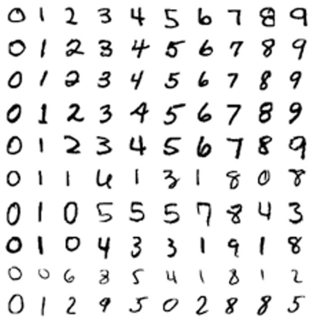
    <figcaption>Mostres de dígits escrits a mà.</figcaption>
</figure>

En aquest exemple, les imatges del *dataset* tenen una resolució relativament baixa; podrien ser retalls d'una imatge més gran de dígits escrits a mà. Tenint en compte que el més habitual és que una xarxa neuronal estigui completament connectada (*fully connected*), és a dir, que totes les unitats d'una capa estiguin connectades a totes les unitats de la capa següent, per a imatges petites (per exemple, de $8 \times 8$ píxels) és computacionalment factible aprendre característiques a partir de la imatge completa. Tanmateix, amb imatges més grans, per exemple de $96 \times 96$ píxels, que seria una mida més propera a la real, trobar les característiques amb tota la imatge en xarxes completament connectades seria molt costós des del punt de vista computacional: per a una arquitectura amb una sola capa oculta de $100$ unitats, tindríem de l'ordre de $10^6$ paràmetres per aprendre ($96 \times 96 \times 100 \approx 9{,}2 \cdot 10^5$).

Una solució a aquest problema podria ser reduir les connexions entre les unitats ocultes i les unitats d'entrada, de manera que cada unitat oculta es connecti només a un petit subconjunt de les unitats d'entrada. Concretament, cada unitat oculta es connectaria només a una petita regió contigua de píxels de l'entrada. Aquesta idea de tenir xarxes connectades localment també s'inspira en el sistema visual biològic, on les neurones de l'escorça visual tenen camps receptius locals, és a dir, només responen a estímuls en una zona determinada de la retina. A més, les imatges naturals tenen la propietat de ser "estacionàries", cosa que vol dir que la projecció d'un objecte a la imatge seria igual en una part de la imatge que en qualsevol altra. Per exemple, el bec d'un ocell té la mateixa aparença tant si és en una part de la imatge com en una altra. Això suggereix que les funcions que aprenem en una part de la imatge també es podrien aplicar a altres parts, i que podem utilitzar les mateixes funcions a tota la imatge.

<figure style="text-align: center;">
    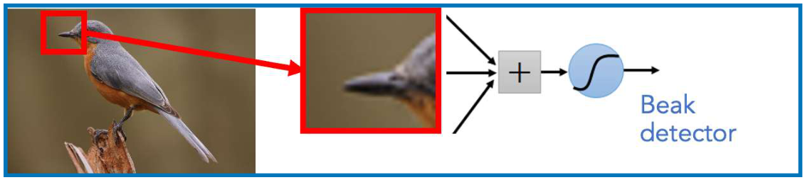
    <figcaption>Detector de becs d'ocell aplicat a una regió de la imatge.</figcaption>
</figure>

És a dir, un cop apreses unes característiques a partir de petits retalls (*patches*) escollits aleatòriament de la imatge, podríem aplicar aquest detector de característiques a qualsevol part de la imatge o a altres imatges. Per exemple, el detector de becs d'ocell, un cop entrenat, funcionarà amb altres imatges.

<figure style="text-align: center;">
    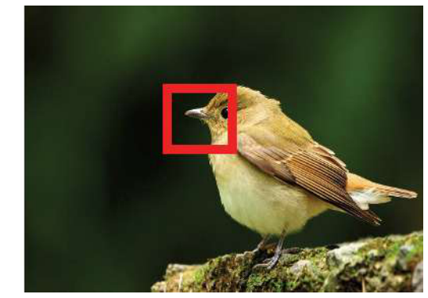
    <figcaption>El detector de becs aplicat a una altra imatge.</figcaption>
</figure>

Aquesta idea, que pot semblar original de l'aprenentatge profund, és una de les tècniques més emprades en la visió per computador, una de les àrees més actives de la intel·ligència artificial de les darreres dècades.

La **convolució** és una operació pròpia del processament del senyal, emprada originalment per crear filtres que permetien realçar o suprimir les altes o baixes freqüències d'un senyal, i que podia funcionar tant en el domini freqüencial com en el domini espacial (vegeu, per exemple, aquesta [explicació](TODO)). Si pensam que una imatge és un senyal 2D discret, l'operació de convolució es pot utilitzar per definir filtres de processament d'imatge, com ara detectors de contorns o el suavitzat d'una imatge.

<figure style="text-align: center;">
    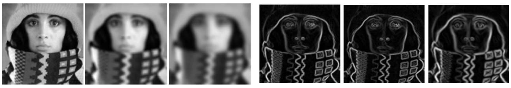
    <figcaption>Filtres de convolució: suavitzat (esquerra) i detecció de contorns (dreta).</figcaption>
</figure>

La definició de la convolució és senzilla: bàsicament hem de definir un filtre com una matriu 2D (o 3D si la imatge és en color) de valors que determinaran la tasca que farà el filtre sobre la imatge (per exemple, la detecció de contorns). Per definir el filtre, primer en fixam les dimensions. Generalment són quadrats, és a dir, tenen el mateix nombre de files i columnes, i per tant només cal definir-ne la mida, $F$. Formalment, la convolució discreta per a una imatge 2D es defineix com:

$$(I * F)_{i,j} = \sum_{m,n} I_{i+m,\,j+n} \cdot F_{m,n},$$

on $m, n \in \{-\lfloor F/2 \rfloor, \ldots, 0, \ldots, \lfloor F/2 \rfloor\}$. La seva aplicació és molt senzilla: la idea és superposar el filtre en una posició de la imatge on hi càpiga i sumar la multiplicació de cada element del filtre pel valor del píxel de la imatge que hi coincideix.

### Un exemple

Vegem un exemple amb un filtre de mida $F = 3$. El primer pas seria superposar el filtre a la primera posició possible de la imatge, marcada en vermell, i calcular-ne la sortida:

<figure style="text-align: center;">
    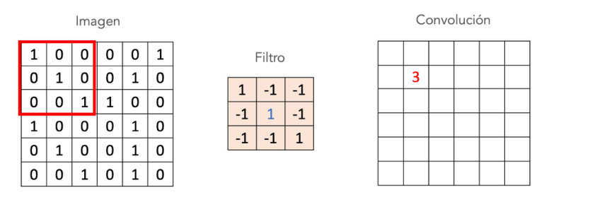
    <figcaption>Primer pas de la convolució.</figcaption>
</figure>

$$(1 \cdot 1) + (-1 \cdot 0) + (-1 \cdot 0) + (-1 \cdot 0) + (1 \cdot 1) + (-1 \cdot 0) + (-1 \cdot 0) + (-1 \cdot 0) + (1 \cdot 1) = 3.$$

Tot seguit, desplaçaríem la finestra a la següent posició possible i tornaríem a calcular la convolució amb els nous valors de la imatge (els del filtre no canvien). En aquest cas, el resultat seria:

<figure style="text-align: center;">
    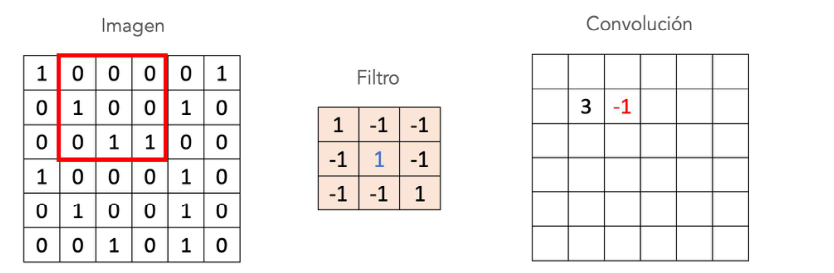
    <figcaption>Segon pas de la convolució.</figcaption>
</figure>

$$(1 \cdot 0) + (-1 \cdot 0) + (-1 \cdot 0) + (-1 \cdot 1) + (1 \cdot 0) + (-1 \cdot 0) + (-1 \cdot 0) + (-1 \cdot 1) + (1 \cdot 1) = -1.$$

I així successivament, fins a arribar a l'última posició possible de la imatge on hi càpiga el filtre:

<figure style="text-align: center;">
    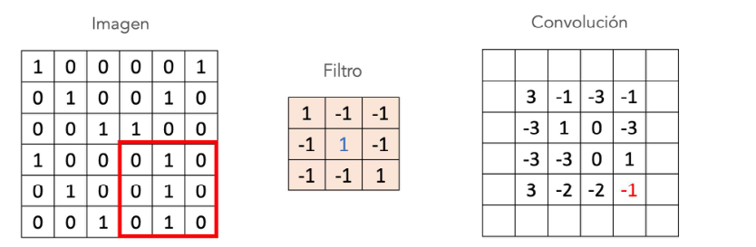
    <figcaption>Última posició de la convolució.</figcaption>
</figure>

Aquest seria el resultat final. Com podem comprovar, els valors màxims del resultat són dos "3", de manera que aquest filtre és un detector de línies diagonals a la imatge.

<figure style="text-align: center;">
    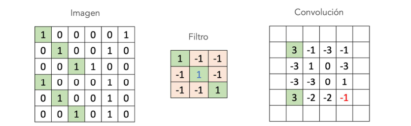
    <figcaption>El filtre detecta les línies diagonals de la imatge.</figcaption>
</figure>

En aquest exemple hem vist com seria un filtre que detecta línies diagonals a la imatge. Però, si volguéssim detectar becs d'ocell o reconèixer caràcters escrits a mà, quins filtres hauríem d'utilitzar? Aquest és l'origen del model que va impulsar l'aprenentatge profund: **les xarxes convolucionals**, en què s'utilitzen xarxes neuronals per aprendre, de manera automàtica, els millors filtres per resoldre un problema on les dades són imatges.

## Les xarxes convolucionals

Una xarxa neuronal convolucional (*Convolutional Neural Network*, CNN) es compon d'una o més capes convolucionals (sovint acompanyades d'un pas de mostreig o *pooling*) seguides d'una o més capes completament connectades, com en una xarxa neuronal multicapa estàndard. Aquesta primera definició la van introduir LeCun et al. (1998) en un model per reconèixer caràcters escrits a mà.

<figure style="text-align: center;">
    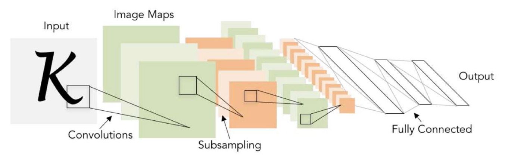
    <figcaption>Arquitectura d'una xarxa convolucional.</figcaption>
</figure>

Les capes convolucionals són l'element clau d'aquests models. En aquestes capes, l'objectiu és aprendre els valors de diferents filtres que, aplicats a la imatge, trobin les característiques més adequades per resoldre l'aplicació definida pel *dataset*. A més, precisament el fet d'haver d'aprendre només els valors de filtres molt més petits que la imatge original fa que les capes convolucionals tinguin molts menys paràmetres per aprendre que si utilitzàssim xarxes completament connectades. Vegem com funcionen de manera gràfica:

<figure style="text-align: center;">
    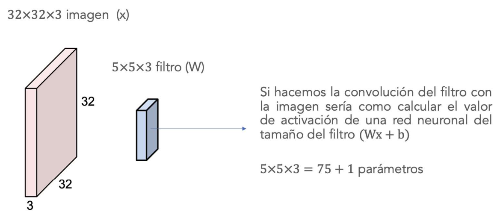
    <figcaption>Fer la convolució d'un filtre de $5 \times 5 \times 3$ amb una imatge de $32 \times 32 \times 3$ equival a calcular el valor d'activació d'una neurona de la mida del filtre ($\mathbf{W}\mathbf{x} + b$), amb $5 \times 5 \times 3 = 75$ pesos més $1$ biaix.</figcaption>
</figure>

La idea bàsica de la figura anterior és que podem utilitzar una arquitectura de xarxa neuronal normal, on la imatge recorreguda per files seria la capa d'entrada, però:

1. **Connexions locals.** Només connectam les unitats que farien la convolució amb el filtre. D'aquesta manera, els pesos de la xarxa són els valors del filtre i, un cop fet l'aprenentatge, la xarxa funcionaria com un filtre de convolució:

<figure style="text-align: center;">
    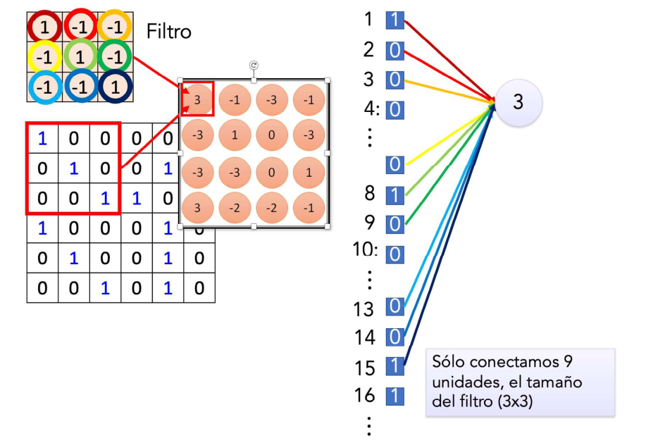
    <figcaption>Només es connecten 9 unitats, la mida del filtre ($3 \times 3$).</figcaption>
</figure>

2. **Pesos compartits.** Per fer la següent operació de convolució amb la següent part de la imatge, es comparteixen els pesos (és a dir, són els mateixos), i així ens estalviam l'aprenentatge de molts de paràmetres:

<figure style="text-align: center;">
    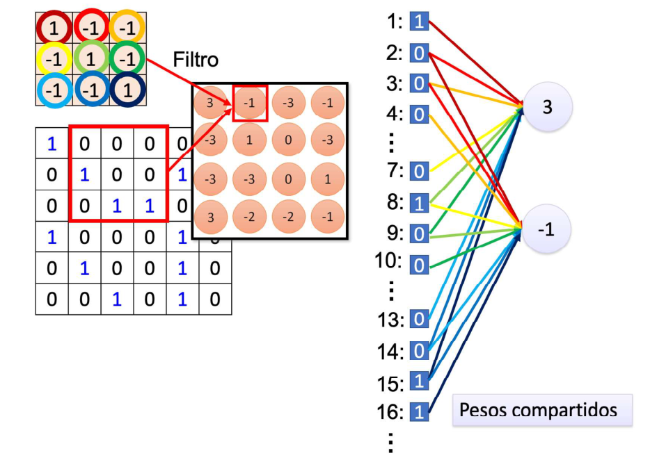
    <figcaption>Pesos compartits entre posicions del filtre.</figcaption>
</figure>

Si repetim aquesta operació per a tots els filtres que consideram que necessitarà el nostre problema, el resultat d'una capa de convolució és un **mapa d'activació** compost per tantes imatges com filtres hàgim definit.

<figure style="text-align: center;">
    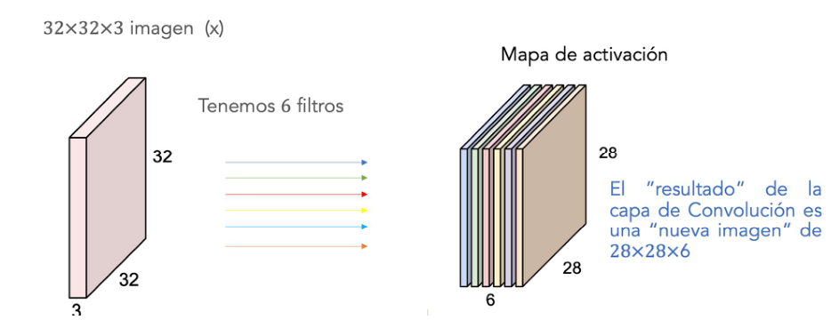
    <figcaption>Amb 6 filtres, el resultat de la capa de convolució és una "nova imatge" de $28 \times 28 \times 6$.</figcaption>
</figure>

De fet, el nombre de filtres d'una capa convolucional és un dels hiperparàmetres que cal definir a priori en una arquitectura de xarxa neuronal convolucional, i que en determina la mida.

> **Càlcul del nombre de paràmetres d'una capa convolucional**
>
> *Hiperparàmetres:*
>
> - $K$, nombre de filtres.
> - $F$, mida del filtre (espacial; si el filtre és 2D, seria $F \times F$).
> - $S$ (*stride*), paràmetre opcional que indica el salt que fa l'operació de convolució sobre la imatge (normalment $S = 1$, és a dir, la finestra de convolució avança píxel a píxel).
> - $P$ (*zero-padding*), paràmetre opcional que indica el nombre de files i columnes de zeros que s'afegeixen a la imatge d'entrada perquè la convolució s'apliqui a tots els píxels de la imatge original. Així, la imatge de sortida pot tenir la mateixa mida.
>
> Si la imatge d'entrada és de mida $N_1 \times M_1 \times D_1$, la imatge de sortida serà $N_2 \times M_2 \times D_2$, on:
>
> $$N_2 = \frac{N_1 - F + 2P}{S} + 1,$$
>
> $$M_2 = \frac{M_1 - F + 2P}{S} + 1,$$
>
> $$D_2 = K.$$
>
> I el nombre de paràmetres (pesos i biaixos) que tindria és:
>
> $$\left(F \times F \times D_1 + 1\right) \times D_2.$$

Per exemple, per a la capa de la figura anterior ($N_1 = M_1 = 32$, $D_1 = 3$, $F = 5$, $S = 1$, $P = 0$, $K = 6$) obtenim una sortida de $28 \times 28 \times 6$ i $(5 \times 5 \times 3 + 1) \times 6 = 456$ paràmetres.

### *Pooling*

Després d'obtenir el mapa d'activació amb les característiques detectades mitjançant convolucions amb els diferents filtres apresos, ens agradaria utilitzar-les per resoldre la nostra aplicació de reconeixement de caràcters. En teoria, podríem "aplanar" (*flatten*) tot el mapa d'activació i connectar-lo a una capa completament connectada i, després, a una capa de sortida amb una funció d'activació *softmax*, però això pot ser molt costós computacionalment. Considerem, per exemple, imatges de $96 \times 96$ píxels, i suposem que hem après $400$ filtres de $8 \times 8$. Cada convolució dona com a resultat una sortida de mida $(96 - 8 + 1) \times (96 - 8 + 1) = 7.921$ i, com que tenim $400$ filtres (característiques diferents), això donaria com a resultat un vector de $7.921 \times 400 = 3.168.400$ característiques. Entrenar un classificador amb entrades de més de 3 milions de característiques pot ser difícil de gestionar i segurament tindríem *overfitting*.

Tanmateix, si recordam que les característiques resultants de la convolució amb la imatge són estacionàries (és a dir, respondrien igual a qualsevol part de la imatge on es trobin), és probable que les característiques útils en una regió de la imatge també ho siguin en altres regions. Per tant, podem reduir el nombre de característiques calculant el valor màxim (o la mitjana) d'una característica concreta sobre una regió de la imatge. Aquesta operació de mostreig es coneix com a ***pooling*** i no requereix paràmetres per aprendre: només cal definir la mida de la finestra on es fa el mostreig.

<figure style="text-align: center;">
    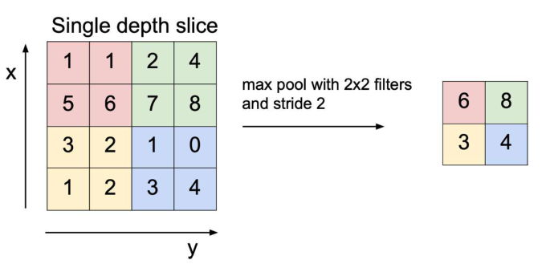
    <figcaption>*Max pooling* amb filtres de $2 \times 2$ i *stride* $2$.</figcaption>
</figure>

Aquesta operació redueix la mida dels mapes d'activació mitjançant estadístics senzills i, així, reduïm el nombre de paràmetres necessaris quan cal aplanar la sortida de la CNN i, per tant, es poden millorar els resultats (menys *overfitting*).

## Resum

En aquest capítol hem definit què és una xarxa neuronal convolucional (CNN). L'arquitectura d'una CNN està dissenyada per aprofitar l'estructura 2D d'una imatge d'entrada (o d'una altra entrada 2D, com un senyal de veu representat mitjançant un espectrograma, que és una imatge). Gràcies a les connexions locals i als pesos compartits, les CNN són més fàcils d'entrenar i tenen molts menys paràmetres que les xarxes completament connectades amb el mateix nombre d'unitats ocultes. Tanmateix, és molt important remarcar que tots aquests avantatges només tenen sentit si les nostres dades són imatges (o tenen una estructura espacial similar); per a dades numèriques tabulars o text, la CNN no seria un model adequat.
